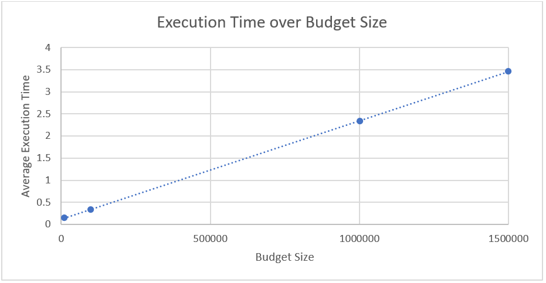
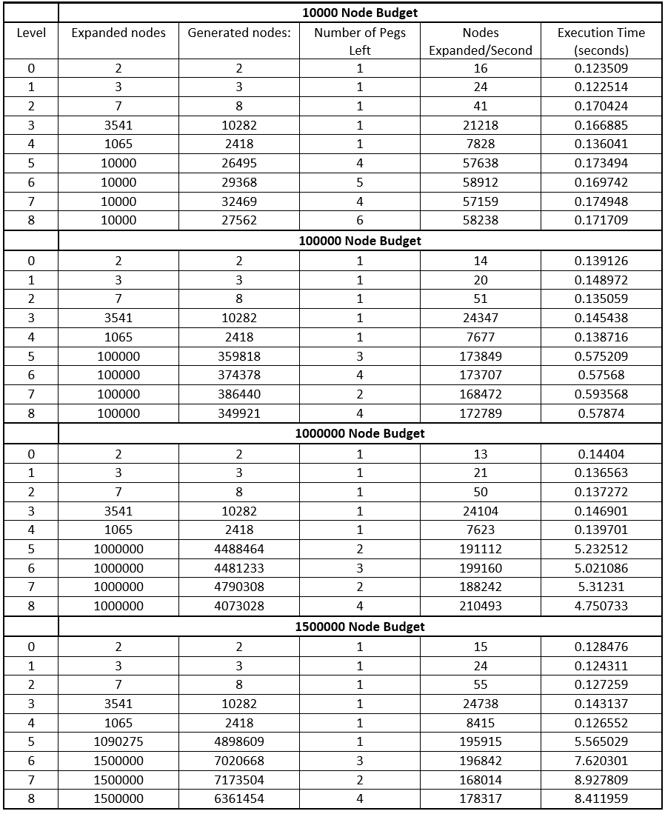
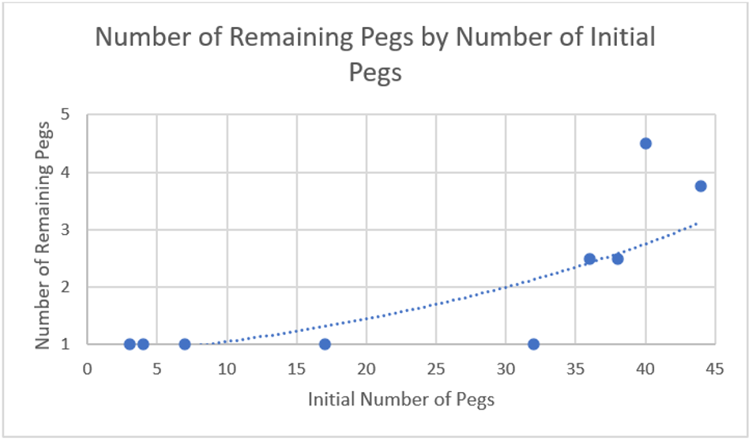
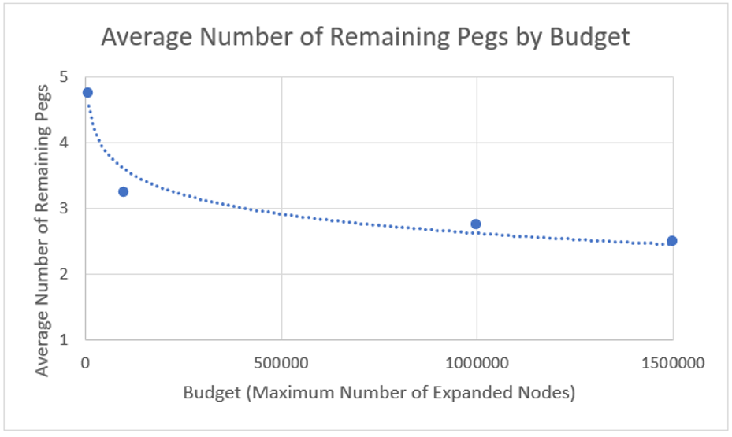

# Peg Solitaire AI

  * [Introduction](#Introduction)
  * [Data and Results](#Data-and-Results)
  * [Conclusion](#Conclusion)
  * [Extension](#Extension)

## Introduction
In this project I coded an AI solver for the game ‘Peg Solitaire’. Given a board with a number of pegs and spaces, the AI solver generates possible moves and then expands the outcome state, updating the solution if the outcome state is closer to victory. Each board state is stored as a node. For each node expanded, all possible valid moves must be generated, and the resulting state stored as a node, if it is unique. This process was done using Depth-First Search and each expanded node was stored in a visited array, hence:

-	Complexity of filling visited array = Number of expanded nodes
-	Complexity of considering each edge = Number of generated nodes

Therefore, the theoretical time complexity of the Peg Solitaire Solver, in terms of number of nodes expanded (vertexes V) and number of nodes generated (Edges E), should be O (|V| + |E|). To try and understand the growth of the number of nodes generated and expanded, the AI solver was run with varying budgets, a budget being the maximum number of nodes that may be explored before program termination. Various data were collected from these tests to allow for analysis. 

In this experimentation, the AI solver was run for all 9 provided board states with varying budgets. The different budgets were 10,000, 100,000, 1,000,000 and 1,500,000 nodes. The output data from these executions can be seen in Figure 2. 

## Data and Results
To examine the time complexity of the algorithm, the execution time was plotted against the budget size. As seen in Figure 1., the execution time appears to increase linearly with the budget size, which supports the time complexity inferred above, as budget size is measured in nodes expanded.

Figure 1. Average execution time for all levels for each budget sizes.

As the budget size increases, the execution time increases linearly, however this is not indicative of the performance of the algorithm in terms of correctness. The correctness of this algorithm is shown by the number of remaining pegs, with 1 being the correct solution, should there be one. However, with varying budget sizes, the solution may not always be reachable. 

Figure 2. Execution Data for AI Algorithm Solving Each Level at Varying Budget Sizes.

To examine the solution quality of the algorithm at different budgets, the average number of remaining pegs over all the budgets was graphed as a function of the number of initial pegs. As shown in Figure 3., there is an apparent polynomial or exponential growth to the number of remaining pegs as the number of initial pegs increases. However, this is due to the simplicity of the first 5 levels in comparison to the budget size, as they all may be solved. To extend the analysis of solution quality, a wider array of peg solitaire layouts should be tested with larger numbers of initial pegs. This would allow further confidence in the conclusions of the solution quality, as these results may be linear as the number of initial pegs increases.

Figure 3. Average Number of Remaining Pegs of All Budget Sizes against Number of Initial Pegs in the Board Layout.

Another metric to evaluate solution quality of the algorithm with is the average number of remaining pegs for a given budget. Omitting the first 4 layouts allows proper examination of the performance of the algorithm where a solution may not be found within the budget restrictions. This relationship highlights the effectiveness of the algorithm in finding the solution within a certain budget of nodes.

As seen in Figure 4., the average number of remaining pegs converges toward 1, in a logarithmic shape as the budget size increases. This is reasonable, as the more nodes are expanded, the higher the likelihood of finding the most correct solution. However, as for any algorithm, AI algorithms should perform as efficiently as possible, and for a small budget the solution quality is exponentially lower. This suggests further room for improvement, as does the still relatively high average for upwards of 1 million node budgets, still not finding the correct solution. The slow convergence indicates that the previous findings of rapid decrease in solution quality being exponential or polynomial with Figure 3., may be correct. This is because of the seemingly logarithmic convergence toward 1 remaining peg, which indicates the solution quality increases slowly over many more node expansions.

Figure 4. Average number of remaining pegs for each budget for layouts 5-8.

## Conclusion
The theoretical time complexity of the Depth-First Search AI algorithm appeared to be supported by the data. The algorithm showed an exponential or polynomial decrease in solution quality over all 9 layouts, and showed a slower convergence toward complete correctness when excluding layouts 1-5. This indicates that the quality of the algorithm increases only over much larger budgets, and deteriorates rapidly under smaller budgets. 

## Extension
Improvements in the algorithm would including not iterating the entire layout board when considering possible moves, as empty spaces are wasted comparisons. Extensions to this experimentation would be using larger budget sizes and more complex board layouts, to gain a further understanding of time complexity and correctness performance of the algorithm for larger numbers of nodes. 
